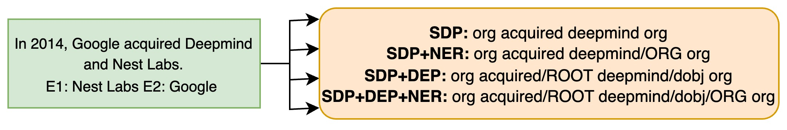

<div align="center">

# Nearest Neighbor Search over Vectorized Lexico-Syntactic Patterns for Relation Extraction from Financial Documents


[](https://pan-dl.github.io/2023/about)
[](https://arxiv.org/abs/2207.08150)

</div>

## Updates
- :grin: (06/12/2023) Workshop.
- :relieved: (27/10/2023) Added detailed running instructions.
- :blush: (06/10/2023) Paper Accepted.

## Abstract

Relation extraction (RE) has achieved remarkable progress with the help of pre-trained language models. However, existing RE models are usually incapable of handling two situations: implicit expressions and long-tail relation classes, caused by language complexity and data sparsity. Further, these approaches and models are largely inaccessible to users who don’t have direct access to large language models (LLMs) and/or infrastructure for supervised training or fine-tuning. Rule-based systems also struggle with implicit expressions. Apart from this, Real world financial documents such as various 10-X reports (including 10-K, 10-Q, etc.) of publicly traded companies pose another challenge to rule-based systems in terms of longer and complex sentences. In this paper, we introduce a simple approach that consults training relations at test time through a nearest-neighbor search over dense vectors of lexico-syntactic patterns and provides a simple yet effective means to tackle the above issues. We evaluate our approach on REFinD and show that our method achieves state-of-the-art performance. We further show that it can provide a good start for human in the loop setup when a small number of annotations are available and it is also beneficial when domain experts can provide high quality patterns.

## Patterns 



## Setup
1. pip install -r requirements.txt
2. run Refind_index_train to create embeddings and index train file.
3. run Refind_index_query to create embeddings and index test file.
4. evaluate.py run top k match algo for each query embed with fallback evaluation for no template found case with f1 score calculation. [see-paper-for-details]
NOTE: for pattern templates mentioned in paper see comments in parse_str method in both 2,3 point files.
```
citation
```
